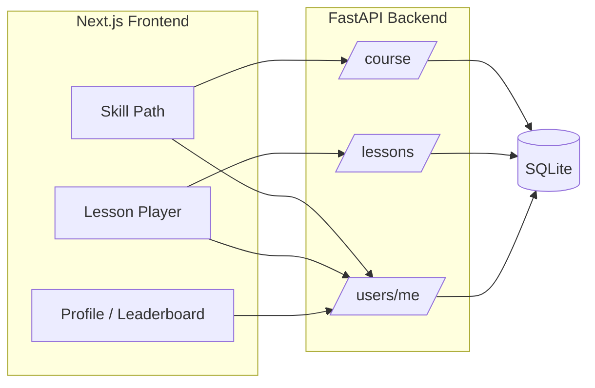

````markdown
# Duolingo Web App Clone

A full-stack Duolingo-style language learning application built for the SDE Fullstack assignment.

The application includes a skill-based learning path, multiple exercise types, lesson progression, XP, streaks, hearts, profile statistics, and a seeded leaderboard.

## Live Demo

- **Frontend:** https://duolingo-clone-seven-mu.vercel.app
- **Backend API:** https://duolingo-clone-api-ubgr.onrender.com
- **API Documentation:** https://duolingo-clone-api-ubgr.onrender.com/docs
- **GitHub:** https://github.com/urvashi1412/duolingo-clone

## Tech Stack

| Layer | Technology |
|--------|------------|
| Frontend | Next.js 15 (App Router), TypeScript, Tailwind CSS |
| Backend | Python 3.11+, FastAPI, SQLAlchemy 2 |
| Database | SQLite (`backend/duolingo.db`, auto-created on startup) |
| Deployment | Vercel + Render |

## Repository Layout

```text
duolingo-clone/

├── frontend/
│   ├── app/
│   ├── components/
│   ├── lib/
│   └── package.json
│
├── backend/
│   ├── app/
│   │   ├── routers/
│   │   ├── models.py
│   │   ├── schemas.py
│   │   ├── database.py
│   │   └── main.py
│   ├── requirements.txt
│   └── Dockerfile
│
├── docker-compose.yml
├── render.yaml
└── README.md
````

## Prerequisites

* Node.js 20+
* Python 3.11+
* npm

## Local Setup

### 1. Backend

```bash
cd backend

pip install -r requirements.txt

python -m uvicorn app.main:app --reload --host 127.0.0.1 --port 8000
```

On first run, tables are created and sample data is seeded, including the Spanish course, default learner, and leaderboard users.

API documentation:

[http://127.0.0.1:8000/docs](http://127.0.0.1:8000/docs)

### 2. Frontend

Open a new terminal:

```bash
cd frontend

npm install

npm run dev
```

Open:

[http://localhost:3000](http://localhost:3000)

For local development, set `NEXT_PUBLIC_API_URL` in `.env.local`:

```env
NEXT_PUBLIC_API_URL=http://127.0.0.1:8000
```

## Architecture Overview



* **Authentication:** Simplified — the API uses the seeded default user (`is_default=true`).
* **Lesson flow:** The client loads exercises, submits answers through `POST /api/lessons/{id}/check`, and completes lessons through `POST /api/lessons/{id}/complete`.
* **Hearts:** Incorrect answers reduce hearts. Hearts regenerate over time and can also be restored through refill/practice actions.
* **Progress:** Lesson completion updates XP, streak, skill crowns, and skill unlocking.

## Database Schema

| Table                  | Purpose                                                                |
| ---------------------- | ---------------------------------------------------------------------- |
| `users`                | Learner profile, XP, streak, hearts, gems, daily goal                  |
| `languages`            | Course language (seeded: Spanish)                                      |
| `units`                | Path sections                                                          |
| `skills`               | Skill nodes on the path                                                |
| `lessons`              | Lessons within a skill                                                 |
| `exercises`            | Typed lesson items with JSON fields for options, pairs, and word banks |
| `user_skill_progress`  | Crowns, unlock state, and lessons completed per skill                  |
| `user_lesson_progress` | Completed lessons and XP earned                                        |

Relationships:

```text
Language → Unit → Skill → Lesson → Exercise

User → UserSkillProgress
User → UserLessonProgress
```

The seeded course contains 2 units, 5 skills, and 3 lessons per skill.

## API Overview

| Method | Path                         | Description                                                 |
| ------ | ---------------------------- | ----------------------------------------------------------- |
| GET    | `/api/health`                | Health check                                                |
| GET    | `/api/users/me`              | Current user stats with heart regeneration                  |
| POST   | `/api/users/hearts/refill`   | Spend gems to refill hearts                                 |
| POST   | `/api/users/practice/refill` | Mock practice +1 heart                                      |
| GET    | `/api/course`                | Full path with locked, available, and completed states      |
| GET    | `/api/lessons/{id}`          | Lesson and exercises                                        |
| POST   | `/api/lessons/{id}/check`    | Validate an exercise answer                                 |
| POST   | `/api/lessons/{id}/complete` | Complete lesson, award XP, update streak, and unlock skills |
| GET    | `/api/leaderboard`           | XP leaderboard                                              |

The `check` and `complete` endpoints also support an optional `simulated_date` ISO date field for testing streak logic.

## Exercise Types

* `multiple_choice`
* `translate_word_bank`
* `match_pairs`
* `fill_blank`
* `type_answer`

## Assumptions & Scope

* Single language: Spanish.
* Small seeded learning path containing 2 units, 5 skills, and 3 lessons per skill.
* Default logged-in user; no real signup/login flow.
* Non-core features such as audio, speech, Super, friends, and IAP are outside the assignment scope.
* UI is inspired by Duolingo's learning patterns and adapted for this assignment.

## Deployment

### Frontend — Vercel

* **Root directory:** `frontend`
* **Environment variable:**

```env
NEXT_PUBLIC_API_URL=https://duolingo-clone-api-ubgr.onrender.com
```

* **Live application:**

[https://duolingo-clone-seven-mu.vercel.app](https://duolingo-clone-seven-mu.vercel.app)

### Backend — Render

* **Root directory:** `backend`
* **Start command:**

```bash
uvicorn app.main:app --host 0.0.0.0 --port $PORT
```

* **Environment variable:**

```env
CORS_ORIGINS=https://duolingo-clone-seven-mu.vercel.app
```

* **Backend API:**

[https://duolingo-clone-api-ubgr.onrender.com](https://duolingo-clone-api-ubgr.onrender.com)

* **API documentation:**

[https://duolingo-clone-api-ubgr.onrender.com/docs](https://duolingo-clone-api-ubgr.onrender.com/docs)

SQLite is used for the assignment. PostgreSQL would be a suitable production database alternative while retaining the SQLAlchemy-based data layer.

## Project Links

| Resource          | Link                                                                                                   |
| ----------------- | ------------------------------------------------------------------------------------------------------ |
| Live Application  | [https://duolingo-clone-seven-mu.vercel.app](https://duolingo-clone-seven-mu.vercel.app)               |
| Backend API       | [https://duolingo-clone-api-ubgr.onrender.com](https://duolingo-clone-api-ubgr.onrender.com)           |
| API Documentation | [https://duolingo-clone-api-ubgr.onrender.com/docs](https://duolingo-clone-api-ubgr.onrender.com/docs) |
| GitHub Repository | [https://github.com/urvashi1412/duolingo-clone](https://github.com/urvashi1412/duolingo-clone)         |


