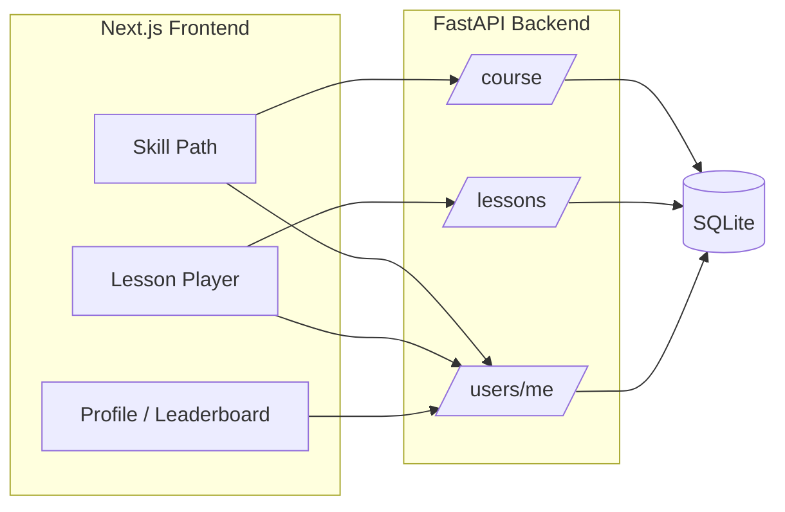

# Duolingo Web App Clone

Full-stack Duolingo-style learning app for the SDE Fullstack assignment. Includes a skill path, multi-type lesson player, XP/streak/hearts gamification, seeded Spanish course content, profile stats, and a seeded leaderboard.

## Tech stack

| Layer | Technology |
|--------|------------|
| Frontend | Next.js 15 (App Router), TypeScript, Tailwind CSS |
| Backend | Python 3.11+, FastAPI, SQLAlchemy 2 |
| Database | SQLite (`backend/duolingo.db`, auto-created on startup) |

## Repository layout

```
duolingo-clone/
├── frontend/          # Next.js UI
├── backend/           # FastAPI API + seed data
└── README.md
```

## Prerequisites

- Node.js 20+
- Python 3.11+
- npm

## Local setup

### 1. Backend

```bash
cd backend
pip install -r requirements.txt
python -m uvicorn app.main:app --reload --host 127.0.0.1 --port 8000
```

On first run, tables are created and sample data is seeded (Spanish course, default learner `learner`, leaderboard users).

API docs: http://127.0.0.1:8000/docs

### 2. Frontend

```bash
cd frontend
cp .env.local.example .env.local   # Windows: copy .env.local.example .env.local
npm install
npm run dev
```

Open http://localhost:3000

Set `NEXT_PUBLIC_API_URL` in `.env.local` if the API is not on `http://127.0.0.1:8000`.

## Architecture overview



- **Authentication**: Simplified — the API always uses the seeded default user (`is_default=true`).
- **Lesson flow**: Client loads exercises → `POST /api/lessons/{id}/check` validates each answer and deducts hearts → `POST /api/lessons/{id}/complete` awards XP, updates streak, skill crowns, and unlocks the next skill.
- **Hearts**: Wrong answers cost one heart; regeneration adds 1 heart every 30 minutes; gem refill and mock practice endpoints restore hearts.

## Database schema

| Table | Purpose |
|--------|---------|
| `users` | Learner profile, XP, streak, hearts, gems, daily goal |
| `languages` | Course language (seeded: Spanish) |
| `units` | Path sections |
| `skills` | Skill nodes on the path |
| `lessons` | Lessons within a skill |
| `exercises` | Typed lesson items (JSON fields for options, pairs, word bank) |
| `user_skill_progress` | Crowns, unlock state, lessons completed per skill |
| `user_lesson_progress` | Completed lessons and XP earned |

Relationships: `Language` → `Unit` → `Skill` → `Lesson` → `Exercise`; progress tables link `users` to skills/lessons.

## API overview

| Method | Path | Description |
|--------|------|-------------|
| GET | `/api/health` | Health check |
| GET | `/api/users/me` | Current user stats (hearts regen applied) |
| POST | `/api/users/hearts/refill` | Spend gems to refill hearts |
| POST | `/api/users/practice/refill` | Mock practice +1 heart |
| GET | `/api/course` | Full path with lock/available/completed states |
| GET | `/api/lessons/{id}` | Lesson + exercises (no raw answers in separate field) |
| POST | `/api/lessons/{id}/check` | Validate answer `{ exercise_id, answer }` |
| POST | `/api/lessons/{id}/complete` | Complete lesson, XP, streak, unlocks |
| GET | `/api/leaderboard` | XP leaderboard (seeded users) |

Optional body field `simulated_date` (ISO date) on check/complete for testing streak logic.

## Exercise types

- `multiple_choice`
- `translate_word_bank`
- `match_pairs`
- `fill_blank`
- `type_answer`

## Assumptions & placeholders

- Single language (Spanish), small seeded path (2 units, 5 skills, 3 lessons each).
- Audio / speech / Super / friends / IAP: Settings placeholders or “Coming soon”.
- Default logged-in user; no real signup/login.
- UI aims to match Duolingo patterns (colors, path, lesson bar, feedback sheet); not official assets.

## Deployment

**Frontend (Vercel)**  
- Root directory: `frontend`  
- Env: `NEXT_PUBLIC_API_URL=https://your-api-host`

**Backend (Railway / Render / Fly.io)**  
- Start command: `uvicorn app.main:app --host 0.0.0.0 --port $PORT`  
- Working directory: `backend`  
- Set `CORS_ORIGINS=https://your-vercel-app.vercel.app` on the backend (comma-separated for multiple origins).

SQLite persists on the backend instance filesystem; for production scale, swap to PostgreSQL with the same SQLAlchemy models.

## Demo

After deploy, add your live URL here:

- GitHub: _(your public repo URL)_
- Demo: _(Vercel + backend URL)_

## Docker (optional)

```bash
docker compose up --build
```

Frontend: http://localhost:3000 · API: http://localhost:8000

## Development scripts

```bash
# Backend tests (manual)
curl http://127.0.0.1:8000/api/course

# Frontend production build
cd frontend && npm install && npm run build && npm start
```
